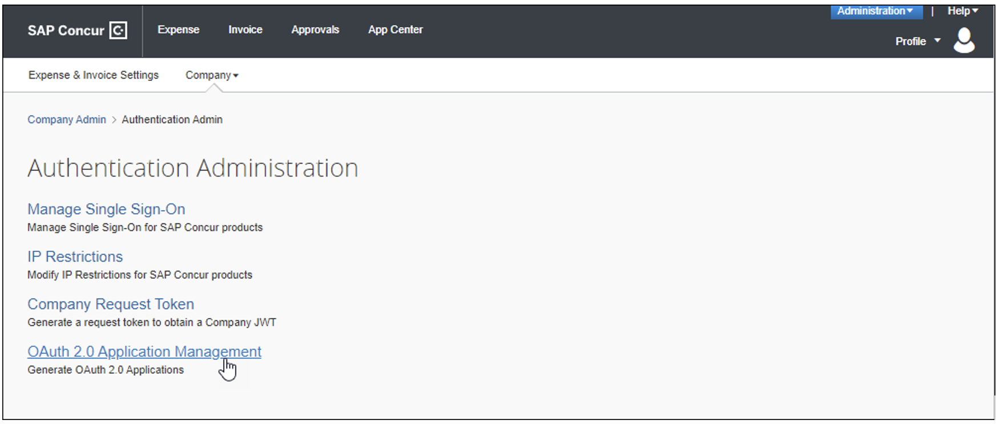
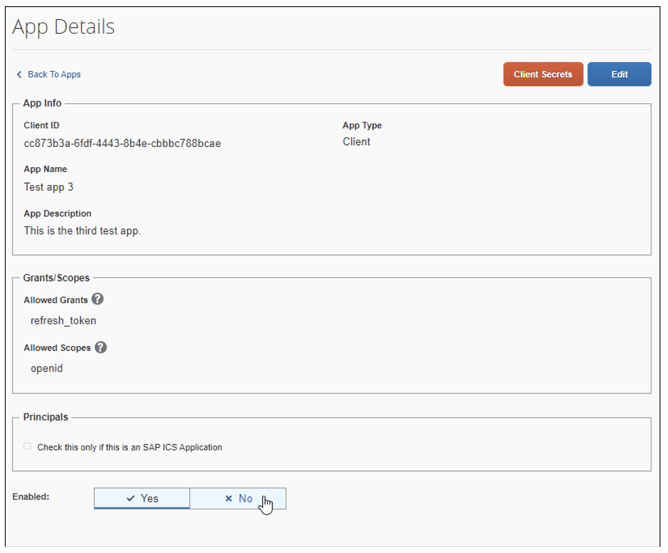

# OAuth 2.0 Application Management Tool

The OAuth 2.0 Application Management tool enables clients who have Client Web Services to generate Client IDs (App IDs) and Client Secrets without contacting SAP Concur support. The new tool also enables clients to create OAuth 2.0 compliant applications. In order to complete the workflow, you must first contact Client Web Services to request that the OAuth 2.0 Application Management tool be enabled for your entity.

Once the tool is enabled, an admin with the Web Services Administrator role will see a link to the OAuth 2.0 Application Management tool on the Authentication Administration page.

>**NOTE**: For admins working with Standard entities, a user with the **Can Administer** permission has the Web Services Administrator role.

The OAuth 2.0 Application Management tool enables clients to do the following:

* Create new OAuth 2.0 apps.
* Edit previously created OAuth 2.0 apps.
* Generate Client IDs (App IDs) and Client Secrets.
*	Generate new Client Secrets for previously created apps.
*	Search for and sort OAuth 2.0 applications.
*	View information about previously created apps such as Client ID, app description, creation date.

## Limitations

This tool is currently only available in the US (North America) and EMEA data centers. All other data centers can contact Client Web Services for assistance.

## What the Admin Sees

When the tool is enabled, the Web Services Admin sees a link to the OAuth 2.0 Application Management tool when they navigate to the **Administration** > **Company** > **Authentication Admin** page.

Clicking OAuth 2.0 Application Management opens the **Application List** page.

On the **Application List** page, the admin sees a list of previously created applications. Clicking the **Client ID** for an application opens the **App Details** page for that app. The admin can also click **Create New App** to open the **Create New App** page and configure a new app.

After clicking **Submit**, the **App Credentials** page appears. The **App Credentials** page displays the **Client ID** and **Client Secret**.

After clicking **Ok**, the **App Details** page appears. On the **App Details** page, the admin can review the **Client ID**, click **Edit** to update the application details, click **Client Secrets** to review the current Client Secret or generate a new Client Secret, and the admin can enable or disable the app.

